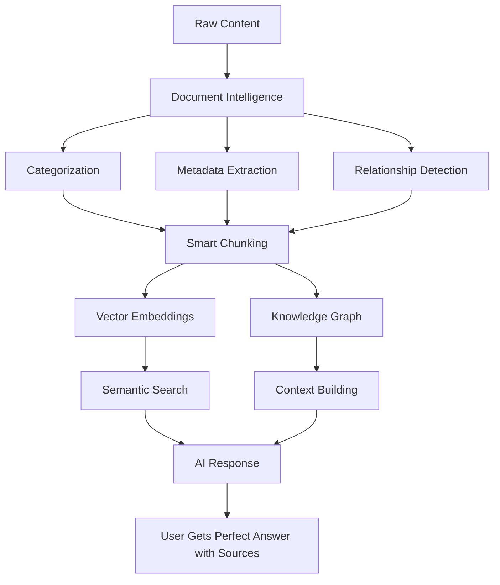

# 🌟 The Story of Singular Source of Truth

## What We've Built: More Than Just an MCP

### The Vision

Imagine having a **superintelligent research assistant** that knows everything about YOUR world - your company's documentation, grandma's recipe collection, decades of family photos with their stories, your local newspaper archives, or even your personal journal entries spanning years.

This isn't just another chatbot. This is **Singular Source of Truth** - a system that transforms mountains of heterogeneous information into an organized, searchable, AI-powered knowledge companion that understands context, remembers relationships, and serves answers with perfect citations.

## 🚀 What Makes This Special

### Beyond MCP: We Do the Heavy Lifting

While MCP (Model Context Protocol) is about **serving** data to AI, we're about **transforming** chaos into intelligence:

```
Raw Chaos                    Our System                    AI Understanding
---------                    ----------                    ----------------
📚 10,000 PDFs        →      Smart Categorization    →     Organized Knowledge
📧 Email archives     →      Relationship Detection  →     Contextual History
🍳 Handwritten recipes →     OCR + Structuring      →     Searchable Cookbook
📰 Newspaper scans    →      Time-aware Indexing    →     Historical Timeline
💬 Meeting transcripts →     Speaker Attribution    →     Who Said What When
📖 Technical manuals  →      Section Extraction     →     Instant Expertise
```

### The Magic: Intelligent Data Processing

We don't just store documents. We **understand** them:

1. **Document Intelligence**
   - Automatically categorizes: "This is a recipe" vs "This is a legal contract"
   - Extracts metadata: dates, authors, participants, versions
   - Detects relationships: "These emails form a conversation thread"

2. **Smart Chunking**
   - Recipes: Keep ingredients with instructions
   - Conversations: Keep speaker turns together
   - Technical docs: Preserve code examples with explanations
   - Books: Maintain chapter boundaries

3. **Incremental Learning**
   - Tracks what changes and when
   - Only updates modified content
   - Learns access patterns for optimization

## 🎯 Real-World Applications

### For Businesses: The Corporate Memory

**Scenario**: A new employee joins your 50-person startup

**Without This System**:
- Weeks of onboarding
- "Ask Sarah about that"
- Lost in Confluence/Notion/Google Docs maze
- Recreating solutions that already exist

**With Singular Source of Truth**:
```
New Employee: "How do we handle customer refunds?"

System: Here's our complete refund process:
1. Policy document from legal (updated 2 weeks ago)
2. Step-by-step guide from operations
3. Three similar cases from last month
4. The email thread where we decided this approach
5. The Slack conversation about edge cases

[All with citations and context]
```

### For Families: The Digital Heritage Keeper

**Scenario**: Preserving three generations of family history

**What It Can Handle**:
- 📷 Scanned photo albums with handwritten notes
- 📜 Grandpa's war letters
- 🍰 Grandma's recipe cards (even handwritten)
- 📹 Interview transcripts with elderly relatives
- 📰 Newspaper clippings about family members
- 🏠 Property deeds and legal documents

**The Magic Moment**:
```
Grandchild: "Tell me about great-grandpa during the war"

System: Based on 47 letters, 12 photos, and 3 newspaper articles:
- He served in the 82nd Airborne from 1942-1945
- Here's his letter describing D-Day (June 7, 1944)
- Photo of him with his unit in France
- Newspaper article about his bronze star
- Grandma's diary entry when he came home

[Everything connected, chronological, with sources]
```

### For Researchers: The Knowledge Synthesizer

**Scenario**: Local newspaper digitization project

**The Challenge**:
- 100 years of newspapers (500,000 pages)
- PDFs, microfilm scans, OCR text
- No organization, no search

**Our Solution**:
```python
# Automatic organization by:
- Date/Time periods
- Topics and themes
- People mentioned
- Geographic locations
- Event correlation

# Now you can ask:
"What happened in Main Street in the 1950s?"
"Show me all articles about the 1938 flood"
"Find mentions of the Johnson family business"
```

### For Communities: The Collective Intelligence

**Local History Society**:
- Oral history transcripts
- Museum catalog entries
- Archaeological site reports
- Historical society newsletters
- Old city planning documents

**Now Accessible As**:
```
"What was here before the mall was built?"
"Find all stories about the old railroad"
"Who were the founding families?"
"What buildings existed in 1900?"
```

## 🔧 The Technical Marvel

### Data Sources We Handle

| Type | Examples | What We Extract |
|------|----------|-----------------|
| **Documents** | PDF, Word, LaTeX | Structure, metadata, citations |
| **Books** | EPUB, MOBI | Chapters, TOC, annotations |
| **Email** | EML, MBOX, PST | Threads, attachments, participants |
| **Transcripts** | SRT, VTT, TXT | Speakers, timestamps, topics |
| **Structured** | CSV, JSON, XML | Relationships, schemas |
| **Code** | Any language | Functions, dependencies, docs |
| **Media** | Images with text | OCR, captions, EXIF data |

### The Intelligence Layer



### Why This Matters

**Traditional Search**: Finds documents
**Our System**: Finds answers

**Traditional Database**: Stores data
**Our System**: Understands knowledge

**Traditional Backup**: Preserves files
**Our System**: Preserves understanding

## 🌈 The Possibilities

### Personal AI Librarian
"Find all mentions of our trip to Paris across emails, photos, and journal entries"

### Corporate Brain
"What did we decide about this feature in 2019 and why did we change it?"

### Family Historian
"Create a timeline of grandpa's life from all available documents"

### Research Assistant
"Summarize all city council discussions about Main Street development"

### Legal Memory
"Find all precedents where we handled similar contracts"

### Medical Records Navigator
"Show all mentions of this symptom across my medical history"

## 🚀 The Future We're Building

### Phase 1: Current ✅
- Multi-source ingestion
- Intelligent categorization
- Smart retrieval
- Citation tracking

### Phase 2: Coming Soon
- Relationship graphs ("This email references that document")
- Timeline views ("Show everything from March 2019")
- Proactive insights ("You might want to know...")
- Cross-language support

### Phase 3: The Vision
- Conversational memory ("As we discussed yesterday...")
- Predictive assistance ("Based on patterns, you'll need...")
- Collaborative knowledge ("Team members also asked...")
- Knowledge evolution tracking ("This understanding has changed over time...")

## 💡 The Philosophy

This isn't about replacing human memory or understanding. It's about **augmenting** it:

- **Remember everything**: No detail is lost
- **Connect everything**: See patterns humans miss
- **Access everything**: Instant recall with context
- **Trust everything**: Every answer has sources

## 🎭 Real Stories This Enables

### The Startup Story
"Show me the complete evolution of our product from the first email to today"

### The Family Recipe Book
"Convert grandma's handwritten cards into a searchable cookbook with her stories"

### The Academic Research
"Find all papers that reference this specific methodology across 30 years"

### The Legal Practice
"Pull up every similar case we've handled with outcomes and strategies"

### The Personal Journey
"Chart my career progression through emails, documents, and projects"

## 🔮 Why This Is Revolutionary

**Before**: Information is scattered, disconnected, and dying in digital graveyards

**After**: Everything is alive, connected, and conversing with you

This is not just software. This is:
- **Corporate Memory** that never forgets
- **Family Heritage** that tells its own stories
- **Research Partner** that reads everything
- **Knowledge Guardian** that preserves and serves

## The Bottom Line

**MCP** asks: "How do we give AI access to data?"

**We** ask: "How do we transform chaos into understanding?"

We're not just building a protocol. We're building the **memory and intelligence layer** for the AI age - where every piece of information, from grandma's recipes to corporate strategies, from newspaper archives to personal journals, becomes part of a living, breathing, searchable intelligence that serves humanity.

This is **Singular Source of Truth** - where your data doesn't just sit there. It thinks, connects, and converses.

---

*"In an age of information overload, the real superpower isn't access to information - it's organized, contextual, cited understanding. That's what we've built."*